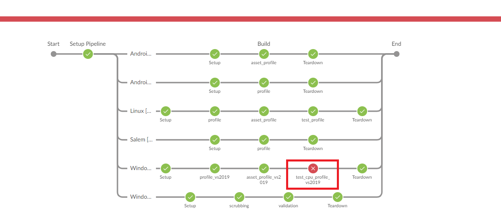

## O3DE Pipeline Root Cause Analysis Runbook

### Overview

When a failure occurs in the Open 3d Engine (O3DE) main branch Automated Review (AR) pipeline, a manual investigation must occur in order to identify and assign issues to the correct owners. This runbook will go over steps for Root Cause Analysis (RCA) for failures in the AR pipeline.

### Links

* [Jenkins main branch updates](https://jenkins-o3de.agscollab.com/job/O3DE/job/main/)
* [Jenkins nightly updates](https://jenkins-pipeline.agscollab.com/job/O3DE-LY-Fork_nightly/)
* TODO[GitHub Issues template]()

### RCA Steps

1. **Go to the [Jenkins main branch update page](https://jenkins-o3de.agscollab.com/job/O3DE/job/main/). Locate and click the failing job.**

1. **Click "Open Ocean Blue" for a visual pipeline view.**

1. **At the top of the page, you will see the pipeline steps. Click on any failing step to view its logs.**

1. **Create a GitHub Issue from the "Automated Review" TODO[template]().**
1. **Identify the type of issue based on the classifications.**
    * **Infrastructure** - An issue with the underlying pipeline framework e.g. Jenkins timeouts, EBS mounting errors, and out of disk space errors.
        * Add "Infrastructure" label
    * **Flaky Test** - A test itself is proven to be incorrectly failing e.g. race conditions, test ordering errors, intermittent failures.
        * Add label for the Special Interest Group's (SIG) test owner
    * **Tooling** - Errors with pipeline scripts or test dependencies e.g. build scripts, LyTestTools, * Editor Python Bindings.
        * Add "Test Tools" label
    * **Legitimate** - A test catches a relevant bug in the pull request.
        * Add label for the SIG issue owner
1. **Complete the details in the GitHub Issue and add any additional labels**
1. **If it's a blocking Issue, notify TODO(email?)**
