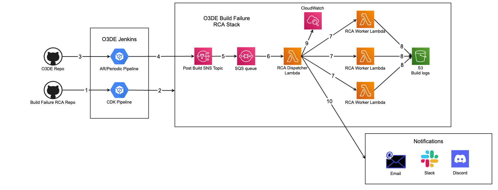
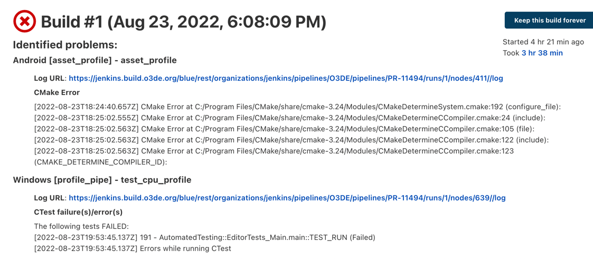
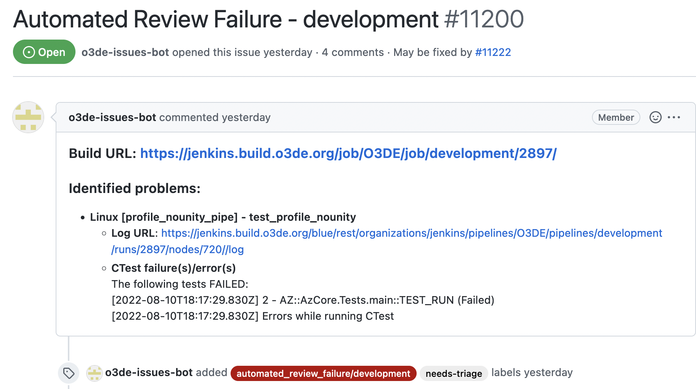

# Build Failure RCA Guide

Self-Service build failure root cause analysis (RCA) system helps us identify and categorize root causes of Jenkins builds failures by scanning build log and searching for certain log patterns. Build failure RCA patterns are stored in O3DE Github repository and are maintained by all O3DE contributors.

### Workflow



### Build Failure RCA Result
Jenkins build failure RCA result is shown at the top of the build page.


A Github issue will also be created for the build failure.



### Data Format of Build Failure RCA Patterns
Build failure RCA patterns are stored as JSON files in scripts/build/build_failure_rca/rca_patterns in Github repository https://github.com/o3de/o3de. 

Build failure RCA pattern is in below JSON format:
- **name:** Name of the build failure pattern.
- **description:** Description of the pattern, it's used to describe the build failure.
- **comment:** Comment to the build failure pattern.
- **category:** Build failure category.
- **single_line:** Log pattern regex tries to match single line if this is true, otherwise, Log pattern regex tries to match multi-lines. Multi-line regex should start or end with ".*" because it will match the entire build log.
- **find_all:** Find all occurrences that match log patterns if this is ture, otherwise, it stops searching on first occurrence.
- **log_patterns:** A list of regex patterns to search from the build logs. To see more about regex, go to http://www.rexegg.com/regex-quickstart.html
- **log_testcases:** Test cases that are used to validate the pattern regex.
- **owners:** A list of failure owners. If a value starts with @, a customized function will be executed and return the owner. For example, if a value is @asset_processing, a customized function asset_processing will read the parsed error message and return the owner of failed asset file.

Each JSON file represents a build failure category.

Example of a RCA pattern that matches single line, and it will find all occurrences.
```
{
  "indications": [
    {
      "name": "Asset Processing",
      "description": "Asset Processing error",
      "comment": "Asset Processing error, see log for more details",
      "single_line": true,
      "find_all": true,
      "log_patterns": [
        "^.*AssetProcessor: JOB LOG:.*ERROR.*$"
      ],
      "log_testcases": [
        "AssetProcessor: JOB LOG: 5/26/2021 10:11 PM | ERROR"
      ],
      "owners": [
        "@asset_processing"
      ]
    }
  ]
}
```
Example of a RCA pattern that matches multi line, and it will stop searching after first occurrence is found.
```
{
  "indications": [
    {
      "name": "CTest failure(s)/error(s)",
      "description": "Errors while running CTest",
      "comment": "Errors while running CTest",
      "single_line": false,
      "find_all": false,
      "log_patterns": [
        "The following tests FAILED:.*Errors while running CTest"
      ],
      "log_testcases": [
        "The following tests FAILED:"
      ],
      "owners": [
        "@ctest"
      ]
    }
  ]
}
```