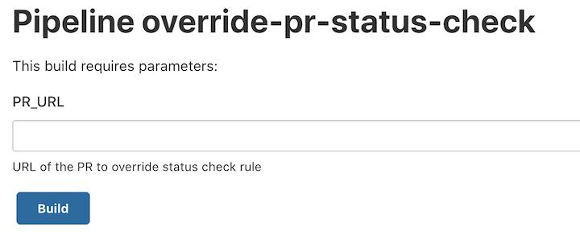
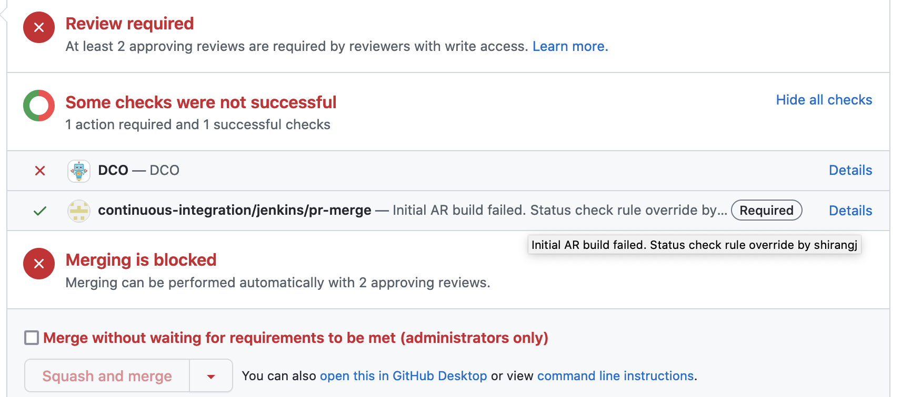

## Override Pull Request Status Check

When the merge of your pull request is blocked by known AR failures from target branch and the AR build failure is irrelevant to your change, you can follow below process to bypass the AR build status check for the pull request.

1. Send a review request to PR's SIG chairs/co-chairs.
2. Ask SIG chairs/co-chairs to review the failed build and confirm the AR build failure is irrelevant to the PR.
3. If you are a SIG chairs/co-chairs, login to https://jenkins.build.o3de.org and run Jenkins job https://jenkins.build.o3de.org/view/Tools/job/override-pr-status-check/ to override PR's status check rule.
4. Copy the URL of the pull request to job parameter 'PR_URL' and click Build. 
   
   Note: Do not copy the AR build URL to the job parameter.
   
5. Check whether the status check "continuous-integration/jenkins/pr-merge" passed for your PR, it should show the person's name who did the override.
   
   
The override will only make the PR pass status check rule "continuous-integration/jenkins/pr-merge", in order to merge the PR, other merge criteria still need to be satisfied.