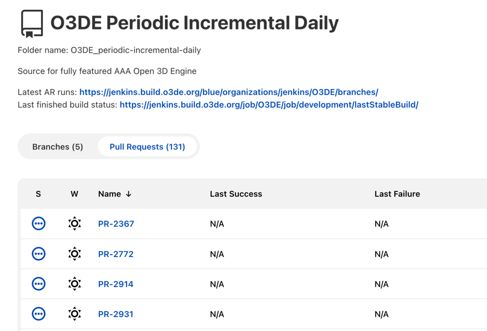
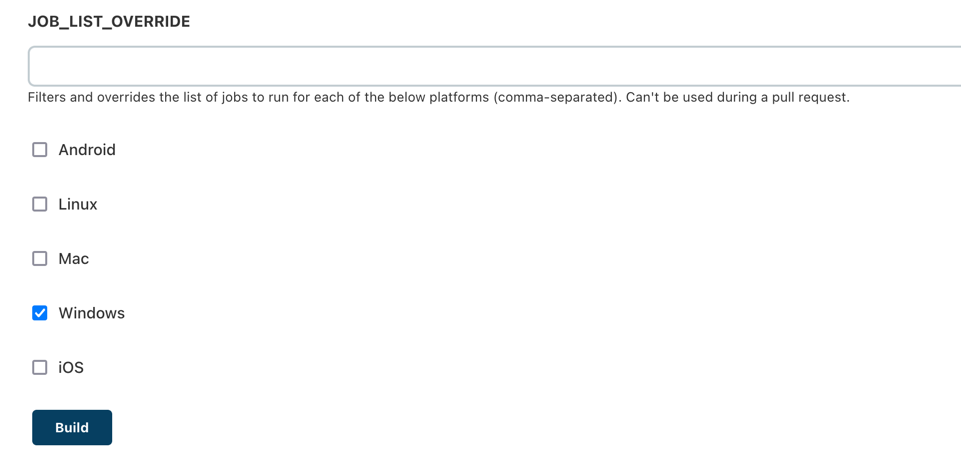

# Periodic pipeline Guide

Periodic pipeline is used to cover the additional platforms and build configurations that are not built in Automated Review pipeline. Though periodic builds are not as critical as AR builds, they provide useful information to ensure the quality of O3DE.

## Periodic Incremental Daily pipeline

Periodic incremental daily pipeline runs every day at 10pm PST, it runs incremental builds and reuses workspace from previous build.

Pipeline URL: https://jenkins.build.o3de.org/job/O3DE_periodic-incremental-daily/

### Build Platforms and Configuration:

Currently periodic incremental daily pipeline build following platforms and configurations.

| Platform  | Build Configuration |
| :---: | :---: |
| Android  | debug  |
| Android  | profile_nounity  |
| Android  | release  |
| Android  | monolithic_release  |
| Linux  | debug  |
| Linux  | profile  |
| Linux  | asset_profile  |
| Linux  | periodic_test_profile  |
| Linux  | sandbox_test_profile  |
| Linux  | benchmark_test_profile  |
| Linux  | release  |
| Linux  | install_profile_pipe  |
| Windows  | debug_pipe  |
| Windows  | profile_nounity  |
| Windows  | periodic_test_profile  |
| Windows  | sandbox_test_profile  |
| Windows  | benchmark_test_profile  |
| Windows  | release  |
| Windows  | monolithic_release  |
| Windows  | install_profile_pipe  |

If you want to add more platforms/build configurations to periodic incremental daily pipeline, add **periodic-incremental-daily** in build configuration's TAG list inside `scripts/build/Jenkins/Platform/<platform>/build_config.json`.

See more instructions at https://github.com/o3de/sig-build/blob/main/AutomatedReview/JenkinsPipelineGuide.md

### Submit Fix to Periodic Incremental Daily Pipeline

Below are the steps to run builds for certain platforms and build configurations of periodic pipeline. 

1. Create a pull request at https://github.com/o3de/o3de.
2. If you are a maintainers/reviewer of O3DE, go to following steps, if not, ask a maintainer/reviewer to complete following steps. 
3. Go to https://jenkins.build.o3de.org/job/O3DE_periodic-incremental-daily/ and click "Pull Requests".
   
4. Click the PR number you just created, if this PR job never runs, click "Build Now" and the first build will do nothing but updating the job configuration, after first build is done, click "Build with Parameters".
5. Add comma-separated build configurations in JOB_LIST_OVERRIDE, and select the platforms to build.
6. Click Build button.

After these steps are done, follow the process of merging a PR to submit the fix.

**Note: The PR builds of periodic pipeline won't make PR status check pass, so the regular PR builds are still required in order to merge the PR.**
