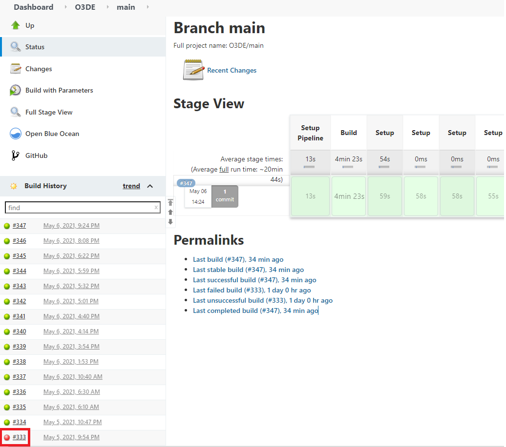
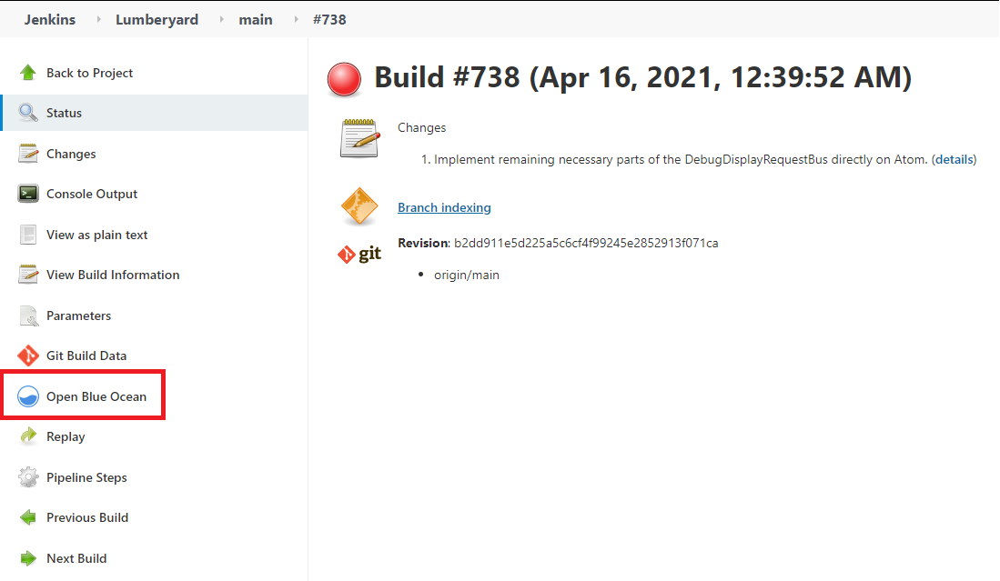

## O3DE Pipeline Root Cause Analysis Runbook

### Overview

When a failure occurs in the Open 3d Engine (O3DE) main branch Automated Review (AR) pipeline, a manual investigation must occur in order to identify and assign issues to the correct owners. This runbook will go over steps for Root Cause Analysis (RCA) for failures in the AR pipeline.

### Links

* [Jenkins main branch updates](https://jenkins-o3de.agscollab.com/blue/organizations/jenkins/O3DE/activity/?branch=main)
* [Jenkins nightly updates](https://jenkins-pipeline.agscollab.com/job/O3DE-LY-Fork_nightly/)
* [GitHub Issues template](https://github.com/aws-lumberyard/o3de/issues/new?assignees=&labels=&template=ar_bug_report-md.md&title=)

### RCA Steps

1. **Go to the [Jenkins main branch update page](https://jenkins-o3de.agscollab.com/blue/organizations/jenkins/O3DE/activity/?branch=main). Locate and click the failing job.**

1. **At the top of the page, you will see the pipeline steps. Click on any failing step to view its logs.**

1. **Create a GitHub Issue from the "Automated Review" [template](https://github.com/aws-lumberyard/o3de/issues/new?assignees=&labels=&template=ar_bug_report-md.md&title=).**
1. **Identify the issue's SIG owner and assign their respective label**
1. **Complete the details in the GitHub Issue and add any additional labels**
1. **Notifications will automatically be sent to the TODO Discord channel**
