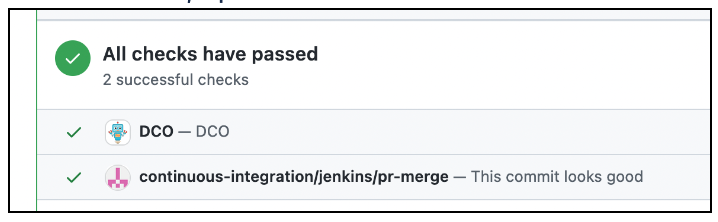
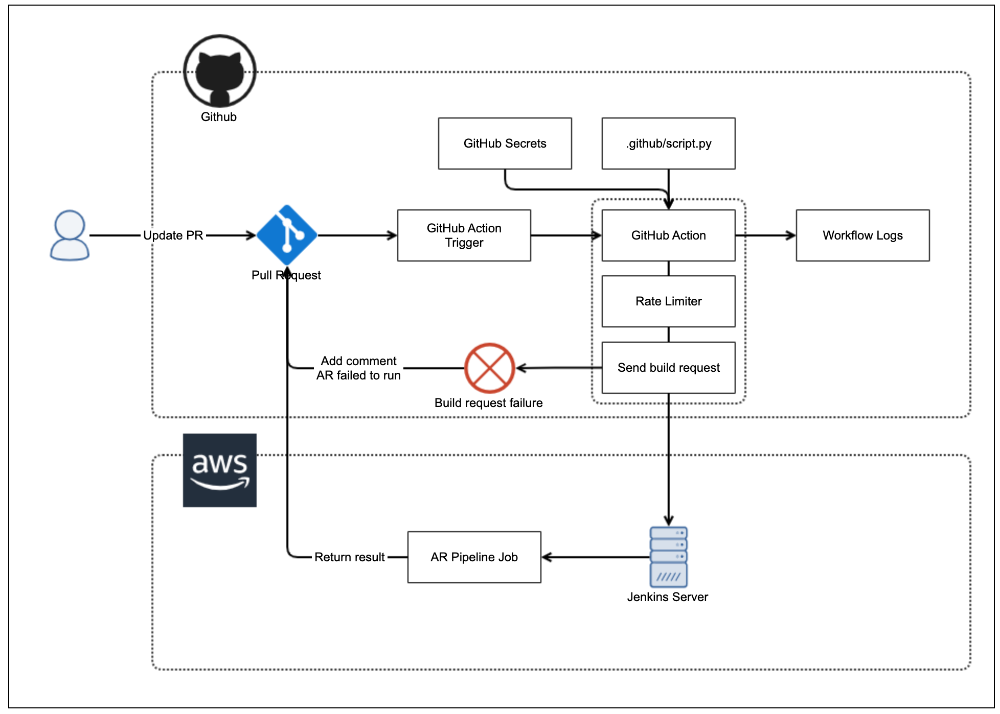

# GitHub PR Workflow v2

## Summary
The purpose of this RFC is to document a proposed improvement to our pull request workflow using GitHub actions. This update will allow maintainers to manage PR workflows easily and minimize the time required to review and merge PRs. For example, an initial planned improvement is to allow maintainers to trigger the Automated Review (AR) for a PR by adding a comment and avoid having to navigate to another site to locate the job for that PR.

There are other workflow improvements that can be added through labels, comments, etc. Those specific workflow improvements will be out of scope of this RFC. This page will focus on the Github actions mechanism that will be used to implement these improvements.

## Feature design description

This feature will utilize GitHub actions to execute the automation requests. Scripts will be added to the .github directory that are required for the workflows. There will be minimal infrastructure that the sig-build will need to maintain. Github's hosted runners will run the workflows and submit the requests to our existing infrastructure if required (e.g. Jenkins server). 

### Workflow Example (Running the AR)

1.  Contributor submits a PR to O3DE.
2.  Maintainers review PR, make comments, then submit their approval after the required changes have been made.
3.  Maintainer/Reviewer adds a comment directly on the PR to trigger the AR  


4.  AR runs starts, updates PR that check has started and updates the PR again with the result.  



Other workflow examples include adding a label once the review is completed so that the PR is merged once the AR is successful.

The main goal is to minimize the time required by maintainers to review and merge in PRs.


## Technical design description




Workflow details

1.  Maintainer/reviewer updates PR. This can be a label, comment, etc.
2.  GitHub action trigger will be configured to capture PR updates.
3.  This triggers a GitHub action that runs the configured script in the repo (e.g. /.github/script.py)
4.  Any credentials required by the GitHub action will be pulled from GitHub secrets
5.  Rate limiter checks request submitted by user is not over the set threshold
6.  The scripts executes, verifies that the commenter has the required permissions, and sends a request to start the AR run to the Jenkins server.
7.  Jenkins triggers the AR run for the specified PR
8.  AR job updates the PR that the run has started and updates it again with the result.

### Setup Details

Setting a GitHub action trigger allows us to select the events that we will use to run our GitHub action. These events are typically specified in the "on:" block in the workflow yaml file.

```
on:
  issue_comment:
    types: [created]
```
`issue comment` will trigger all events for each comment (add, edit, delete) so we will filter to only created comments under types.

Also the "issue_comment" event occurs for comments on both GitHub issues and pull requests. So we'll need to filter for PR comments with the following.

```
if: ${{ github.event.issue.pull_request }}
```

The end result would look similar to this:
```
name: GitHub PR Workflow

on:
  issue_comment:
    types: [created]

jobs:
  PR-Comment:
    if: ${{ github.event.issue.pull_request }}
    runs-on: ubuntu-latest
    steps:
	  - uses: actions/checkout@v3
	  - uses: actions/setup-python@v3
		with:
          python-version: '3.9'
      - run: python run-ar.py
```

### GitHub Action Script

Within the Github workflow we can add custom actions (e.g. actions/setup-python@v3) to perform certain jobs. To actually trigger the AR run we'll utilize a script we'll have in the repo (e.g. run-ar.py) and run this script to perform all the required actions.

### GitHub Secrets
This service allows us to store sensitive information that our GitHub action requires as part of the execution. For example, we'll need to credentials to submit the AR run request to Jenkins.

### Jenkins Server
The Jenkins server referenced in this RFC will be the O3DE server (https://jenkins.build.o3de.org/) and will be the target of the AR run requests.

### Permissions

The same permissions used to grant access to run the AR and merge PRs will be used in this automated workflow. For example, only users that have permissions to run the AR will be able to add a comment that actually triggers the AR. This also applies to members that are part of child teams of the larger maintainer/reviewer teams. 

These permissions checks can be performed in the GitHub action workflow itself or as part of the script execution.

### Rate Limiting

Custom rate limits will be placed on the GitHub action workflow runs in order to prevent unnecessary runs triggered by unintentional or malicious means. Prior to executing each run we will add a step to check the number of workflow runs requested by the user. If it is over our set threshold, we will limit the requests and add a comment to the PR. 

For workflows like triggering the AR, we can also check if there is a run already in-progress and if there are already additional runs in the queue. If there are AR runs queued above our threshold, we'll prevent adding more to the queue. 

When the GitHub action workflow is rate limited due to too many requests a single comment will be added to the PR for visibility. 

### Comment Syntax

Comments added to PRs that are used to trigger the GitHub actions will be prefixed with `"/"` (e.g. `/run-ar`) The purpose is to make it easy to separate feedback comments from automation triggers.

## Are there any alternatives to this feature?

Yes, we can utilize webhooks to trigger automations running on our own hosted machines or on AWS managed services. The option of using GitHub actions here allows the sig-build to easily maintain these workflows by updating the scripts in the .github directory without having to maintain configs for other services. 

## How will users learn this feature?

The O3DE contribution website pages and README docs will be updated to instruct maintainers and reviewers to utilize new automated workflows as they are added. 

## Open Questions

Q: Is there a way to de-dupe the command comments? There could be many submitted for some PRs. 
A: This is up for debate as it may be useful to keep the command history in the PR. However, we will need to investigate ways to reduce the noise on the PRs for the command comments. 

