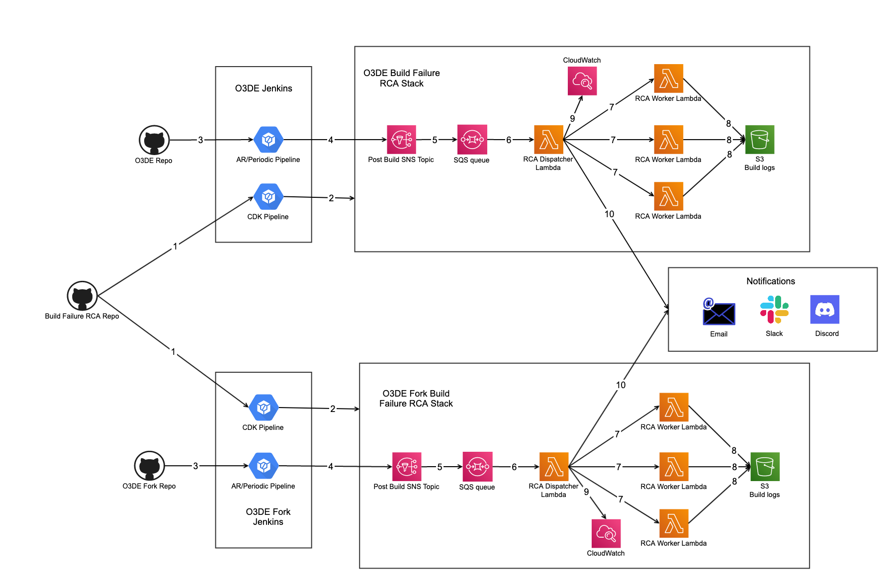

# Build Failure RCA Improvement

### Summary:
Build failure RCA system currently in use is to identify and categorize root causes of Jenkins builds failures. It depends on Jenkins Build Failure Analyzer plugin and search for certain log patterns from the build log.

However, current build failure RCA system has some bottlenecks due to the use of Build Failure Analyzer plugin:

1. Build failure root causes identified are not grouped by build platforms/configuration because O3DE AR/Periodic build log is aggregated by log messages from multiple build platforms/configurations.
2. It stops searching for the same root cause when the first occurrence of that root cause is found.
3. Multi-line regex searching is not supported.
4. Build failure RCA is done on Jenkins server, and it increases Jenkins server load when multiple builds are running. 

The purpose of this RFC is to propose a solution to deprecate the use of Build Failure Analyzer plugin and solve the above bottlenecks.

### What is the relevance of this feature?
This is important because O3DE contributors will have more control over how build failure root causes are identified, and this can be used in below scenarios:
1. Do separate build failure RCA for each platform/configuration.
2. Identify all failed tests, failed assets, compilation/linking errors and build environment failures.
3. Identify owners of all failures.
4. Create tickets for identified failures and assign the tickets to failure owners.

### Feature design description:
Instead of using Build Failure Analyzer plugin to do build failure RCA on Jenkins server, use lambda functions to retrieve build log of each build platform/configuration and do build failure RCA. 

A CDK package is used to deploy build failure RCA lambda functions, and build failure RCA patterns will be stored in the same CDK package. A CI/CD pipeline (Jenkins pipeline or CodePipeline) will be setup to verify and deploy the CDK package on every CDK change.

Use cases:
1. **Update build failure RCA pattern:** O3DE contributor clones the CDK repo and creates pull requests to update build failure RCA pattern, a sig-build maintainer will run a CI/CD pipeline to verify the PR and then merge the PR. Once the PR is merged, the CI/CD pipeline will run automatically and deploy the CDK package.
2. **Identify build failure root cause of O3DE AR/Periodic build:** When O3DE AR/periodic build fails, the build failure RCA system will retrieve build log of each platform/configuration and scan the logs separately, once all build failures root causes are identified, the metrics will be published to CloudWatch.
3. **Send build failure notification:** Identified build failure root causes are grouped by failure type and platform/configurations, they will be included in notifications via email, Discord and Slack.

### Technical design description:

#### Build Failure RCA CDK Stack
Build failure RCA system is deployed by CDK, it can be easily deployed to different environments.

Build failure RCA CDK Stack consists of following AWS resources:

1. **Post Build SNS Topic:** SNS topic is used to receive post build message from AR/Periodic builds, and it triggers Lambda function to do build failure RCA.

2. **RCA Dispatcher Lambda Function:** RCA dispatcher lambda function is triggered by post build SNS topic, it retrieves AR/Periodic build data and dispatch the actual RCA work for each build platform/configuration to separate lambda functions. Once it received the RCA result from RCA worker lambda function, it uploads the RCA result to CloudWatch. If notification is enabled, it will send build failure notifications via email, Discord or Slack.

3. **RCA Worker Lambda Function:** RCA worker lambda function retrieves build log of a certain build platform/configuration, it scans the build log and search for log messages that match build failure RCA patterns, once the RCA work is done, it uploads the build log to S3 and return RCA result to RCA dispatcher lambda function.

4. **Build Log S3 Bucket:** Build log S3 bucket is used to store build logs grouped by build platform/configuration.

5. **CloudWatch Metrics:** CloudWatch metrics is used to store build failure RCA result.

#### CDK Deployment pipeline
The CDK deployment pipeline is a Jenkins pipeline that deploys build failure RCA CDK stack on build failure RCA repo change events.

#### Verifying Build Failure RCA Repo Pull Request
Every build failure RCA repo change must go through pull requests. Pull requests will be tested by CDK deployment pipeline that is hooked with the PR status check rule. The CDK deployment pipeline will deploy a temporary CDK stack for the pull request and run some tests, once the tests are done, the CDK stack will be destroyed.

#### Retrieving Build Logs
AR/Periodic build log is aggregated by log messages from multiple build platforms/configurations, the only way to re-group the log by platform/configuration is to use BlueOcean API.

First the RCA dispatcher lambda function send a GET request
```
https://{JENKINS_URL}/blue/rest/organizations/jenkins/pipelines/{JOB_NAME}/runs/{BUILD_NUMBER}/nodes?tree=id,displayName,result,type,edges[*]
```
"tree" parameter is used to reduce Jenkins server load and reduce response size.

Response of the GET request contains the pipeline stage data.

1. **Parallel Stage:** A parallel stage is the text label at the beginning of each parallel build, for example, Android [release] is a parallel stage.
```
  {
    "_class" : "io.jenkins.blueocean.rest.impl.pipeline.PipelineNodeImpl",
    "displayName" : "Android [release]",
    "id" : "116",
    "result" : "SUCCESS",
    "type" : "PARALLEL",
    "edges" : [
      {
        "_class" : "io.jenkins.blueocean.rest.impl.pipeline.PipelineNodeImpl$EdgeImpl",
        "id" : "778",
        "type" : "STAGE"
      }
    ]
  },
```
2. **Setup Stage:** After the parallel stage is the setup stage, setup stage is to setup build node, pull source codes from Github and install build dependencies.
```
  {
    "_class" : "io.jenkins.blueocean.rest.impl.pipeline.PipelineNodeImpl",
    "displayName" : "Setup",
    "id" : "778",
    "result" : "SUCCESS",
    "type" : "STAGE",
    "edges" : [
      {
        "_class" : "io.jenkins.blueocean.rest.impl.pipeline.PipelineNodeImpl$EdgeImpl",
        "id" : "1112",
        "type" : "STAGE"
      }
    ]
  },
```
3. **Build Stage:** Build stage is the stage runs the actual build task.
```
{
    "_class" : "io.jenkins.blueocean.rest.impl.pipeline.PipelineNodeImpl",
    "displayName" : "release",
    "id" : "1112",
    "result" : "SUCCESS",
    "type" : "STAGE",
    "edges" : [
      {
        "_class" : "io.jenkins.blueocean.rest.impl.pipeline.PipelineNodeImpl$EdgeImpl",
        "id" : "1718",
        "type" : "STAGE"
      }
    ]
  },
```
The RCA dispatcher lambda function uses these pipeline stage data to build a relationship graph of build platform/configuration, and then it triggers the RCA worker lambda function to do build failure RCA for failed build platform/configuration.

RCA worker lambda function sends a GET request
```
https://{JENKINS_URL}/blue/rest/organizations/jenkins/pipelines/{JOB_NAME}/runs/{BUILD_NUMBER}/nodes/{ID}/log
```
to get the build log of a certain build platform/configuration.
#### Build Failure RCA Patterns
RCA worker lambda function scans the build log and search for log messages that match build failure RCA patterns.

Current build RCA patterns from https://github.com/aws-lumberyard/build-failure-rca/tree/main/build-failure-rca/rca-patterns can be reused.

#### Workflow


1. A change in build failure RCA repo triggers the build failure RCA CDK deployment pipeline.
2. The build failure RCA CDK deployment pipeline deploys build failure RCA CDK stack to AWS accounts that are using build failure RCA system.
3. Change in O3DE repo or O3DE fork repo triggers the AR or Periodic builds.
4. After each AR or Periodic build completes, it publishes build data to post build SNS topic.
5. Post build SNS topic triggers the RCA dispatcher lambda function.
6. RCA dispatcher lambda function retrieves AR/Periodic build data and dispatch the actual RCA work for each build platform/configuration to separate RCA worker lambda functions. 
7. RCA worker lambda function retrieves build log of a certain build platform/configuration, it scans the build log and search for log messages that match build failure RCA patterns, once the RCA work is done, it uploads the build log to S3 and return RCA result to RCA dispatcher lambda function.
8. Once RCA dispatcher received the RCA result from RCA worker, it uploads the RCA result to CloudWatch metrics.
9. Once RCA dispatcher received the RCA result from RCA worker, it sends build failure notifications via email, Discord or Slack.

### What are the advantages of the feature?
- It offloads build failure RCA work from Jenkins server to lambda functions, and thus reduce loads on Jenkins server.
- Build failure RCA system can be deployed by CDK, it can be easily deployed to different AWS accounts that are willing to use build failure RCA system.
- Build failure RCA is done per build platform/configuration instead of whole AR/Perodic pipeline.
- Build logs can be kept longer on S3.
- More detailed build failure RCA result can be included in build failure notification.

### What are the disadvantages of the feature?
- This is not directly integrated with Jenkins, and thus the build failure RCA result cannot be shown on Jenkins UI.
- Each Jenkins environment that uses build failure RCA system need to setup the CDK deployment pipeline and hook up with build failure RCA repo.

### How will this be implemented or integrated into the O3DE environment?
The build failure RCA CDK deployment pipeline will be created on O3DE Jenkins and the CDK stack will be deployed to O3DE AWS account.

### Are there any alternatives to this feature?
Yes, an alternative is to write a Jenkins plugin that can offload build failure RCA work from Jenkins server, and do separate build failure RCA for each pipeline stage. 

### How will users learn this feature?
- The internal guide of build failure RCA pattern will be made public.
- A detailed build failure RCA CDK pipeline setup document will be created.

### Are there any open questions?
- Can this build failure RCA system be used for any Jenkins pipeline build other than O3DE builds?
  - Yes, this biuld failure RCA system is not tied to O3DE builds, it can be used in any Jenkins pipeline build.
    

