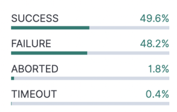

# RFC - AR Cost Reduction Plan

# Introduction

The purpose of this RFC is to outline SIG-Build’s plan to reduce O3DE’s infrastructure costs to run the Automated Review (AR) for all incoming pull requests.

## Why are we concerned about AR costs?

We use the AR as our primary mechanism to test commits for PRs submitted to O3DE. The jobs within the AR execute builds and tests for several platforms and all of them must pass before the PR is merged. We also utilize the AR to run the same set of jobs post-merge on the target branch (e.g. development). Then there are other jobs that run on a daily and weekly cadence that provide coverage not included in the AR.

One major concern is the total number of times we run the AR for the number of PRs we receive. Not only do we require an AR run for every submitted PR, but also about half of the PRs require more than one AR run before all the jobs succeed. This can be the result of an error caught by the AR or the result of a flaky test both of which require another AR run.

The total number of AR runs combined with its total runtime contribute to O3DE’s rising infrastructure costs. Additionally, the current configuration of the AR makes it expensive to run and difficult for SIG-Build to onboard new platforms without exceeding our spending targets. 

This also limits our ability to scale and introduce new features to improve developer velocity. As our incoming contributions increase, so do our costs by a significant amount.  

For the same reasons, this also makes it difficult for contributors to run a version of the AR setup on their own fork. The ability to easily run the same checks on their fork will benefit developers as they iterate on their branch by catching errors before they submit a PR. 

## How can we reduce our costs?

SIG-Build investigated [several opportunities](https://github.com/o3de/sig-build/issues/77) where we can improve our AR configuration, utilize lower cost resources, and revisit our testing approach.

### Improve our AR Configuration

SIG-Build has recently started the effort to reduce our build times across all platforms and is currently investigating where optimizations can be made. 

We will address the stability of our AR pipeline to reduce the number times a maintainer has to repeat the AR run for flaky tests or any other AR failure that is not directly related to the incoming code change. 

We will also investigate using a merge queue in order to significantly reduce the total number of AR runs we need to execute. The purpose of the merge queue will be to batch together incoming PRs and run the AR on the combined changes. If the AR succeeds, the PRs are then merged in together. If the AR fails, the PR that caused the failure is removed from the queue and AR is retried. SIG-Build is currently working on a [mechanism](https://github.com/o3de/sig-build/blob/main/rfcs/rfc-bld-20220623-1-build-failure-rca.md) to identify owners of AR build failures and would enable this automation in a merge queue. 

### Utilize lower cost build resources

Addressing the runtimes and stability of the AR will allow us to migrate some of the jobs to lower cost build resources. This will include utilizing lower spec instances in our current infrastructure and also hosted platforms like GitHub Actions. 

One benefit of integrating GitHub Actions in our PR workflow is that we can take advantage of GitHub's hosted runners. This provides a cost benefit since the hosted runners are free to use for public repos like O3DE. They are lower spec machines, so optimizing our AR configuration is critical to onboarding to this service. 

Due to the complexity of our project, we anticipate there will be some jobs that cannot be migrated from our existing AR infrastructure to GitHub's hosted platform. However, each task we migrate provides us with a significant cost reduction opportunity.

Also once we implement a merge queue, using GitHub Actions will allow us to run quicker tests on each PR at no cost to O3DE while diverting the more expensive tests to run more infrequently in the merge queue. 

### Revisit our testing approach in the PR workflow

A very importance aspect of reducing our costs is revisiting our approach to setting up our build and test targets in the AR. This investigation will be driven by SIG-Build in collaboration will the other SIGs to determine how to get the best value from the AR.

One major item we will need to review is how we currently setup our builds and tests in a single job that covers all the targets for that platform. We will need to identify what is the best way to setup our build and test targets and if we can split up our targets into separate jobs.

We will also need to determine which components of the AR we want to keep as a gate for PRs and which components can be moved to post-merge checks. Discussing our budget limitations and tradeoffs to code quality in the development branch will be an important component of this evaluation. 

This will also include a discussion with other SIGs on what is the acceptable gate of entry for the development branch considering the cost it takes to complete a full run of the AR with all our current build/test targets. Are we allocating the right resources to run on each PR and can we have other checks run in a lower cadence (e.g. merge queue, post-merge checks, etc.)?

## What are the benefits?

In addition to lowering our costs, the engineering effort to optimize our AR setup will provide opportunities for SIG-Build to better scale our resources, improve developer workflows, and enable the AR to provide more value to O3DE. 

With an improved AR setup we can easily scale as we intake more contributions and provide features to increase developer velocity without significantly increasing our costs.

Contributors will also benefit as we make it easier to deploy the AR pipeline infrastructure and utilize GitHub's hosted platforms. Running builds and tests with smaller targets will make it easier to use lower cost resources. 

Onboarding more of our workflows to GitHub Actions will also allow contributors to easily test their changes on supported platforms on their own fork. When a user forks a repo the workflows defined in the upstream repo are also propagated to the fork. This minimizes the effort required by developers to run these tests and will allow them to easily test platforms they may not have access to locally. 

# Deployment Plan

Accomplishing the goals in this RFC will be completed in phases. In the first phase we will implement the foundational work for the AR pipeline that will be required to utilize lower cost resources and merge queues. 

In the second phase we will start migrating jobs that are not time-sensitive (e.g. post-merge jobs, daily jobs, etc.) to lower cost resources. We will also start testing out a merge queue in our PR workflow. 

Finally in phase 3 we will work on onboarding AR jobs to hosted platforms and deferring the longer running checks to either the merge queue or post-merge branch checks.

## Phase 1

In this phase we will address the cost inefficiencies in our current setup. Here we will target optimizations with EC2 and EBS in addition to reconfiguring our AR pipeline. This will provide the framework to start onboarding jobs to lower cost resources and merge queues. 

_Phase 1 Cost Improvements:_

* Optimize the use of our current infrastructure and AR setup.
* Integrate S3SIS into our build process. This will also minimize our EBS usage and improve our caching options on hosted platforms. 
* Reduce build/test runtimes. The purpose of this is to reduce cost and prepare the migrate of our workflows to GitHub actions.
* Investigate how we can split up build and test targets so we can onboard our jobs to lower cost resources.

## Phase 2

In phase 2 we will start the work to onboard our time insensitive workflows to GitHub actions. This will allow SIG-Build to test how our checks will perform running on GitHub’s hosted runners. We will also investigate using [GitHub’s merge queue](https://docs.github.com/en/repositories/configuring-branches-and-merges-in-your-repository/configuring-pull-request-merges/managing-a-merge-queue) in our PRs. 

_Phase 2 Cost Improvements:_

* Onboard time-insensitive workflows to GitHub actions using their hosted runners. This will include daily, weekly, and development branch checks. 
* Reduce total number of AR runs by integrating a merge queue. 

## Phase 3

Phase 3 will require engineering effort and collaboration between SIG-Build and other SIGs to make changes in our approach in executing our compilation, unit, and integration tests. This will include work in partnership with SIG-Testing to split up our checks into smaller chunks so they scan run effectively within the GitHub actions workflows. 

This will also include the TIAF (Test Impact Analysis Framework) by SIG-Testing to reduce our testing scope on each AR run. The details of this work are captured in this RFC: https://github.com/o3de/sig-testing/blob/main/rfcs/tiaf.md 

_Phase 3 Cost Improvements:_

* Migrate AR jobs that are compatible with their hosted runners to to GitHub Actions.
* Separate longer running tasks that are not suitable to gate PRs or are incompatible with lower cost resources to the merge queue, post-merge, or daily/weekly jobs.

# Cost Reduction Details

## Reduce the number of AR Runs per PR

One of our main cost reduction goals is to reduce the total number AR runs and bring down the AR failure rate. 

### Merge Queue

The purpose of the merge queue is take multiple in-flight PRs and test them together before they are merged. Instead of running the AR on each PR individually then merging it directly, maintainers will have the option to select ***Merge when ready*** after they have reviewed the PR. Once in the queue it is tested with other PRs using the required checks configured for the merge queue. 

GitHub's option to setup PR merge queues are currently in public beta. More details can be found here: https://github.blog/changelog/2023-02-08-pull-request-merge-queue-public-beta/ 

Using merge queues we would allow us to run the AR more infrequently based on the number of PRs we batch together. We can mitigate potential failures by providing some smaller checks running on each PR. We will also need to improve the AR's stability.

### AR Stability

Unnecessary retries and high failure rates due to unreliable tests frustrate PR authors, waste developer time, and increase our infrastructure costs.

To mitigate this we need to provide an easier way for contributors to run the same checks in a branch in their fork prior to submitting a pull request. To be sure, we have published our Jenkins Pipeline configuration that runs the AR (https://github.com/o3de/o3de-jenkins-pipeline). While this allows developers to run the same AR pipeline on their fork, it still requires spinning up maintaining some infrastructure. 

Providing an easier mechanism like GitHub Actions minimizes any infrastructure setup and maintenance for contributors looking to test their changes. The main benefit beside the free cost of their hosted runners is that workflows defined in the O3DE repo will automatically be brought over when they create their fork. 

Below are details we discovered regarding AR stability during our last release. 

### Example: 22.10 Release AR Metrics

For the 22.10 release we saw a high AR failure rate (48%) and total runs (2.2 avg per PR) for PRs targeting the stabilization branch. There was an [issue](https://github.com/o3de/o3de/pull/12346) in the stabilization branch that made AR runs intermittently fail. This went undetected for a few days while developers attempted to re-run their ARs to get a successful build. To prevent issues like this, we need to setup mechanisms that raise awareness about these failures and escalate it so developers address the issue.

Below is the percentage of each AR result for the 22.10 release branch. About half of the attempts ended in failure with a total number of 228 AR runs. 

## Reduce Build and Test Runtime

Another component we want to improve is the total runtime for AR for PRs. This is a metric we constantly monitor because updates to dependencies, introduction of new features, or other code changes can affect it over time. 

For example, migrating O3DE to VS2022 introduced an issue that [caused slower builds](https://github.com/o3de/o3de/issues/12257) compared to VS2019. While we made great progress reducing build times since the release of O3DE, there are still opportunities to address recent increases over the past few months. 

## Utilize GitHub Hosted Runners

GitHub actions provides free usage for public repos using their standard hosted runners. The main trade-off with the lower cost is the slower build times using GitHub's runners compared to our self-hosted ones using 16-core machines. 

We have already migrated our quicker running tests (Validation) to GitHub Actions:

* Validation check: https://github.com/o3de/o3de/actions/workflows/validation.yaml 

Details on the hardware specs for GitHub's standard hosted runners.

|Operating System	|CPU	|Memory	|Storage	|
|---	|---	|---	|---	|
|Windows/Linux	| 2-core CPU (x86_64)	|7GB	|14GB SSD	|
|MacOS	| 3-core CPU (x86_64)	|14GB	|14GB SSD	|

More details info on the hosted runners can be found here: [GitHub-hosted Runners](https://docs.github.com/en/actions/using-github-hosted-runners/about-github-hosted-runners)

In addition to taking advantage of the lower infrastructure cost, another reason to migrate to GitHub Actions is that it allows contributors to easily run tests in their own fork. 

When GitHub actions are added to a repo, those workflows are also included when a user forks the repo making it easier for them to run those same actions prior to submitting a PR. 

### **GitHub Larger Runners**

GitHub also provides larger spec runners (up to 64 cores) that can be added to GitHub action workflows. The specs and billing rates can be found here:

* Specs: https://docs.github.com/en/actions/using-github-hosted-runners/using-larger-runners#machine-specs-for-larger-runners
* Billing rates: https://docs.github.com/en/billing/managing-billing-for-github-actions/about-billing-for-github-actions#per-minute-rates

_Comparison between GitHub Larger Runners and AWS EC2 Instances (using 16-core machines):_

|Platform	|AWS EC2/EBS (Hourly)	|GitHub Hosted Runner (Hourly)	|
|---	|---	|---	|
|Windows (16 core)	|$2.16	|$7.68	|
|Linux (16 core)	|$0.99	|$3.84	|

* EC2 pricing is based on On-Demand instances running in US-West-2. Also includes estimated EBS volume costs. 

## Risks

* Changes to the core engine code could result in longer running build times (e.g 4-5 hours) using GitHub’s hosted runners in our current setup. We will need to mitigate this by optimizing our builds and tests.
* GitHub-hosted runners only provide 14GB of storage (mounted on /mnt) for all supported platforms. There is an unsupported workaround that frees up to 50GB of space that would provide enough room in the workspace for the generated artifacts.
* Build or test failures in a merge queue with batched PRs can be difficult to debug especially with flaky tests. We will need to be aggressive about removing these types of tests in the merge queue runs. 

## Pull Request Stages

Below are the areas where we integrate checks in our process to intake contributions to O3DE. The jobs that we can optimize and run more frequently will be placed as PR checks and the more expensive, longer running tests will fall towards the periodic pipelines. 

* Pull Request Checks
    * This is where the current AR pipeline runs and where we can make the most cost improvements. Checks placed at this stage are required to pass before a PR can be merged. 
    * Here we can work on optimizing the jobs within the AR and determine which jobs can run on hosted platforms. 
    * Utilize GitHub actions on hosted runners here will allows us to reduce our costs significantly. Jobs that are not compatible with the hosted runners can continue to run on the current infrastructure or moved to the merge queue or post-merge checks.
* Merge Queue
    * Here we will investigate placing approved PRs in a merge queue. The merge queue will batch approved PRs together and run another set of checks.
* Post-Merge checks
    * These checks run on the target branch of the incoming PRs (e.g development branch). 
    * Longer running tests that are not suitable to gate PRs in a merge queue or are incompatible with GitHub's hosted runners would be moved here.
* Periodic Pipelines
    * These pipelines run on schedule and are performed either on a daily or weekly basis.
    * These pipelines provide coverage for platforms jobs that are too lengthy or expensive to run in the AR. 

# What is the Automated Review?

The Automated Review (AR) refers to a set of jobs that perform automated testing for pull requests submitted to O3DE. These tests are required to pass before PRs are merged. A SIG maintainer can run the AR on a pull request after they've performed their code review.

## AR Infrastructure

AR jobs are orchestrated by Jenkins Pipeline and are defined using a Jenkinsfile stored in the O3DE repo: https://github.com/o3de/o3de/blob/development/scripts/build/Jenkins/Jenkinsfile

The Jenkins server and its build nodes are hosted in AWS. The build nodes utilize EC2 instances for the hosts and EBS volumes for the build workspace. When a pull request is submitted a pipeline is generated, however build nodes are not created until an AR run is triggered. After an AR run starts, the required platform instances are spun up, builds/tests are executed, and the instances are terminated at the end of the run. Jenkins then reports the results back to the pull request. The EBS volume is retained to cache artifacts for the next run. A daily automated task deletes the EBS volumes for merged and inactive PRs.

## Infrastructure Costs

Total infrastructure costs associated with the AR averaged about $11k for the past year (prior to any credits applied). 

In our current setup we’ve prioritized faster build times with some cost reduction measures. In the effort to further reduce our costs, we will investigate optimizing our current infrastructure, utilizing lower cost hosted platforms, and improving our build and testing workflow. 

## Developer Velocity

Over the past 6 months, there was an average of 265 pull requests successfully merged in to O3DE each month. One of the goals of SIG-Build is to maintain this velocity and prevent the cost reduction efforts from significantly impact it. We will continue tracking this metrics as we proceed through the cost reduction phases.
